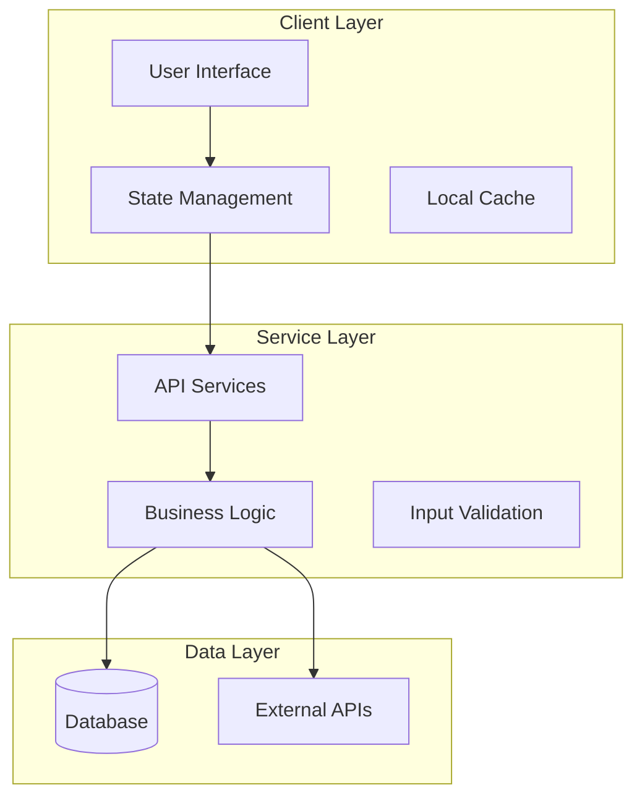

# [Feature Name] Design Document

## Overview

[Provide a brief description of the feature and its purpose. Explain how it fits into the overall system architecture and what problem it solves.]

## Architecture

### High-Level Architecture



### Technology Stack

**Frontend Components**
- [List the key frontend technologies, frameworks, and libraries]
- [Include state management approach]
- [Mention any platform-specific considerations]

**Backend Services**
- [List backend technologies and frameworks]
- [Include database and storage solutions]
- [Mention any external service integrations]

**Infrastructure**
- [Deployment and hosting information]
- [Monitoring and logging solutions]
- [Security and performance considerations]

## Components and Interfaces

### Core Components

#### 1. [Component Name]
```typescript
interface [ComponentName] {
  // Define the interface for this component
  [property]: [type]
  [method](): [returnType]
}

class [ComponentName] implements [InterfaceName] {
  // Implementation details
}
```

#### 2. [Service Name]
```typescript
interface [ServiceName] {
  // Define service interface
  [method](params: [ParamType]): Promise<[ReturnType]>
}
```

### API Endpoints

#### [Endpoint Category]
```typescript
// [HTTP Method] [endpoint-path]
interface [EndpointName]Request {
  // Request parameters and body
}

interface [EndpointName]Response {
  // Response structure
}
```

### Data Models

#### Database Schema
```sql
-- [Table Name]
CREATE TABLE [table_name] (
  id UUID PRIMARY KEY DEFAULT gen_random_uuid(),
  [field_name] [DATA_TYPE] [CONSTRAINTS],
  created_at TIMESTAMP DEFAULT NOW(),
  updated_at TIMESTAMP DEFAULT NOW()
);
```

#### Client-Side Models
```typescript
interface [ModelName] {
  id: string
  [property]: [type]
  createdAt: Date
  updatedAt: Date
}

// State management structure
interface [FeatureName]State {
  [stateProperty]: [type]
  // Actions
  [actionName]: ([params]) => void
}
```

## Error Handling

### Error Categories and Handling Strategy

#### 1. [Error Category]
```typescript
class [ErrorCategory]Handler {
  static handle(error: [ErrorType]): ErrorResponse {
    switch (error.type) {
      case '[ERROR_TYPE]':
        return {
          message: '[User-friendly error message]',
          action: '[suggested_action]',
          fallback: '[fallback_behavior]'
        }
    }
  }
}
```

#### 2. [Another Error Category]
```typescript
// Similar structure for other error types
```

### Global Error Handling
```typescript
// Error boundary or global error handler implementation
```

## Testing Strategy

### Testing Approach

#### 1. Unit Tests ([percentage]%)
```typescript
describe('[Component/Service Name]', () => {
  describe('[method name]', () => {
    it('should [expected behavior]', async () => {
      // Test implementation
    })
  })
})
```

#### 2. Integration Tests ([percentage]%)
```typescript
describe('[Integration Test Suite]', () => {
  it('should [test cross-component interaction]', async () => {
    // Integration test implementation
  })
})
```

#### 3. E2E Tests ([percentage]%)
```typescript
describe('[E2E Test Suite]', () => {
  it('should [test complete user workflow]', async () => {
    // E2E test implementation
  })
})
```

### Testing Tools and Configuration

**Unit Testing**
- [Testing framework and tools]
- [Mocking strategies]
- [Test data management]

**Integration Testing**
- [Integration testing tools]
- [Test environment setup]
- [Database testing approach]

**E2E Testing**
- [E2E testing framework]
- [Test automation tools]
- [Cross-platform testing strategy]

## Platform-Specific Considerations

### [Platform 1] Specific Features
```typescript
interface [Platform1]Features {
  // Platform-specific interfaces and implementations
}
```

### [Platform 2] Specific Features
```typescript
interface [Platform2]Features {
  // Platform-specific interfaces and implementations
}
```

### Cross-Platform Abstractions
```typescript
// Unified interfaces that work across platforms
interface PlatformAdapter {
  [feature]: [FeatureService]
}

class PlatformFactory {
  static create(): PlatformAdapter {
    // Platform-specific factory implementation
  }
}
```

## Performance Considerations

### Performance Requirements
- [List specific performance targets]
- [Response time requirements]
- [Throughput expectations]

### Optimization Strategies
- [Caching strategies]
- [Database optimization]
- [Frontend performance optimization]
- [Network optimization]

### Monitoring and Metrics
- [Performance monitoring tools]
- [Key performance indicators]
- [Alerting thresholds]

## Security Considerations

### Security Requirements
- [Authentication and authorization]
- [Data encryption]
- [Input validation]
- [API security]

### Security Implementation
- [Security measures and controls]
- [Threat mitigation strategies]
- [Compliance requirements]

## Deployment and Infrastructure

### Deployment Strategy
- [Deployment approach]
- [Environment configuration]
- [CI/CD pipeline]

### Infrastructure Requirements
- [Hardware/cloud requirements]
- [Scaling considerations]
- [Backup and disaster recovery]

## Migration and Rollback

### Migration Strategy
- [Data migration approach]
- [Backward compatibility]
- [Rollout plan]

### Rollback Plan
- [Rollback procedures]
- [Data recovery]
- [Fallback mechanisms]

## Assumptions and Dependencies

### Technical Assumptions
- [List technical assumptions]
- [Third-party service availability]
- [Framework/library compatibility]

### External Dependencies
- [External services and APIs]
- [Third-party libraries]
- [Infrastructure dependencies]

### Risk Mitigation
- [Risk identification]
- [Mitigation strategies]
- [Contingency plans]

---

**Requirements Traceability**: This design addresses requirements [list requirement IDs from requirements.md]

**Review Status**: [Draft/In Review/Approved]

**Last Updated**: [Date]

**Reviewers**: [List of reviewers]