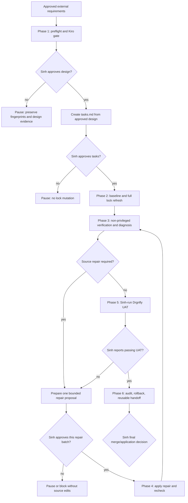

# Drgnfly Flake Lock Refresh and Approval-Gated Repair Orchestration Design

## Overview

This document designs the six-phase, resumable workflow for a full `flake.lock`
refresh whose blocking target is Drgnfly. It preserves every input declaration in
`flake.nix`, verifies all four NixOS configurations, and permits source repairs
only as bounded batches approved by Sinh.

The approved requirements phase is the external artifact:

`/home/sinh/Documents/ai-usage/agent-teams/requirements/artifacts/2026-08-31-drgnfly-flake-update-orchestration.md`

That artifact remains the authoritative scope and requirements source for ticket
NX-042. This repository-local design does not replace or broaden it. The Kiro
approval order is requirements approval, design approval, tasks approval, then
implementation. At this checkpoint only `design.md` may be created. `tasks.md`,
lock refresh, source edits, builds, tests, evaluation, formatting, commits, and
privileged commands remain prohibited until their applicable gates are passed.

## Architecture

### High-Level Architecture



Every phase boundary writes a resume fingerprint to the persistent audit
artifact. A phase result is reusable only when the target HEAD, lock SHA-256,
three local-input HEADs, clean-state expectations, and relevant source/document
hashes still match. A mismatch invalidates results from the earliest affected
phase.

### Six-Phase Mapping and Gates

| Phase | Design responsibility | Entry gate | Exit evidence / next gate |
|---|---|---|---|
| 1 — Preflight and Kiro approval | Validate four repositories, capture the original lock digest, create this design, and pause | Approved requirements and lock-protected feature checkout | Sinh approves this design before `tasks.md`; Sinh then separately approves `tasks.md` before Phase 2 |
| 2 — Baseline and full lock refresh | Capture no-write warning/evaluation baseline, refresh the complete lock graph, prove `flake.nix` declarations are unchanged, inventory root-input changes, and checkpoint locally | Approved Kiro tasks | Lock-refresh diff, warning inventory, command ledger, resume fingerprint, and local commit |
| 3 — Non-privileged verification and diagnosis | Run flake check, evaluate Drgnfly/Elderwood/FireFly/Lily, build Drgnfly without a result symlink, classify warnings, and diagnose failures | Phase 2 fingerprint matches | Passing checks proceed to Phase 5; source failures produce a proposal only |
| 4 — Sinh-approved repairs | Apply one approved root-cause batch, format only its changed Nix files, run targeted and aggregate rechecks, and checkpoint locally | Explicit Sinh approval for a proposal of at most 5 files and 200 source LoC | Approval, diff, checks, commit, and updated fingerprint; return to Phase 3 |
| 5 — Sinh-run Drgnfly UAT | Supply exact privileged test and rollback commands and wait for Sinh's observations | All non-privileged blockers pass and warnings are dispositioned | Sinh-reported pass without critical regression; agents run no privileged command |
| 6 — Audit, rollback, and reusable handoff | Complete the audit, validate rollback in a disposable clone, exercise routine-ticket routing examples, and make a recommendation | Phase 5 pass and matching fingerprints | Complete artifact and local commit; Sinh retains merge/application authority |

### Technology Stack

**Repository and configuration**
- Git for clean-state gates, local checkpoints, diffs, and rollback identifiers.
- Nix flakes and the repository's existing repo-owned output discovery.
- Existing NixOS configurations for Drgnfly, Elderwood, FireFly, and Lily.

**Orchestration and evidence**
- Repository-local Kiro design/tasks documents for approval ordering.
- PA ticket comments, deployment activity, session logs, and persistent builder
  artifacts for approvals, command ledgers, warning dispositions, and resume state.
- SHA-256 for the lock and relevant document/source fingerprints.

**Infrastructure**
- Existing Nix daemon, configured caches/builders, and local input repositories.
- Non-interactive commands with recorded exit codes.
- Builds default to at most 4 jobs and 2 cores per job.
- No CI configuration or new general-purpose updater is introduced.

## Components and Interfaces

### Core Components

#### 1. Preflight Gate

Inputs are the canonical repository path, expected feature branch, three required
local-input paths, and `flake.lock`. It fails closed unless each path is its Git
top level and each worktree is clean. On success it emits the baseline manifest
in this document and the persistent phase report.

#### 2. Approval Gate Controller

The controller recognizes only explicit Sinh decisions recorded by the parent
orchestrator/ticket flow. It enforces these independent gates:

1. design approval before creating `tasks.md`;
2. tasks approval before baseline probes or lock mutation;
3. per-batch approval before any source repair;
4. explicit warning acceptance when a new warning cannot be removed;
5. Sinh-run privileged UAT before a success recommendation; and
6. Sinh's final merge/application decision.

Silence, elapsed time, an agent inference, or approval of a different artifact
never satisfies a gate.

#### 3. Resume Fingerprint Validator

```text
ResumeFingerprint = {
  phase_id,
  phase_state,
  target_head,
  lock_sha256,
  local_input_heads,
  expected_clean_states,
  allowed_changed_files,
  relevant_file_sha256,
  approvals,
  local_commit_ids
}
```

The validator compares fresh read-only observations with the persisted record.
The initial clean baseline remains historical after approved Kiro documents are
created; subsequent resumes must additionally match an explicit changed-file
allowlist and hashes for those documents. Unexpected files or content invalidate
the affected evidence rather than being normalized or repaired automatically.

#### 4. Lock Refresh and Declaration Guard

The lock refresh component runs only in Phase 2 after tasks approval. It records
pre/post lock data and an inventory for every changed root input. A before/after
fingerprint and diff of `flake.nix` must prove that declared URLs, branches,
tags, refs, follows relationships, and intentional pins did not change. Any
required declaration change is out of scope and routes back to requirements.

#### 5. Verification and Warning Classifier

The verifier executes the approved deterministic sequence:

- no-write baseline probes;
- `nix flake check --no-write-lock-file`;
- toplevel evaluation for Drgnfly, Elderwood, FireFly, and Lily; and
- `nix build --no-link --no-write-lock-file
  .#nixosConfigurations.Drgnfly.config.system.build.toplevel --max-jobs 4 --cores 2`.

Drgnfly is the only blocking build and runtime target. The other three hosts are
blocking evaluation surfaces but do not receive physical/runtime claims. Every
new warning is classified as fixed, explicitly accepted by Sinh with rationale,
or blocking; final success allows no undispositioned new warning.

#### 6. Repair Batch Controller

A proposal names exactly one root cause, affected files, proposed diff, source
LoC count, targeted checks, and aggregate rechecks. It may affect no more than
5 files and 200 source LoC. Generated `flake.lock` lines and approved Kiro
documents are excluded from that source limit. An over-limit proposal blocks for
a revised Kiro plan and approval. External-input repository edits, unrelated
cleanup, and protected machine/network/storage changes are always out of scope.

#### 7. Privileged UAT Handoff

After non-privileged checks pass, the agent supplies Sinh with the exact
Drgnfly `sudo sys test` command and rollback commands but never executes them.
Sinh's reported command result and critical-service observations become Phase 5
evidence. A failure returns to diagnosis; a missing report remains blocked.

#### 8. Audit and Rollback Reporter

The persistent report records every command, exit code, changed-file list,
warning disposition, approval decision, diff, commit ID, fingerprint, rollback
instruction, and final disposition. It also records command skips and why they
were skipped, so prohibited or gated actions are auditable rather than implicit.

### Data Models

#### Baseline Fingerprint — Captured Before Repository Write

| Repository | Branch | HEAD | `git status --porcelain=v1 --untracked-files=all` | Clean |
|---|---|---|---|---|
| `/home/sinh/git-repos/sinh-x/personal-nixos` | `feature/NX-042-flake-update-drgnfly` | `8a96151a684d44a8818c068d93b97123a9e57ca2` | empty | true |
| `/home/sinh/git-repos/andafin/infrastructure/andafin-jira-mcp` | `feature/bitbucket-cloud-integration` | `331314d76885dcd96c241c7cc5a9ecf4dc3c9774` | empty | true |
| `/home/sinh/git-repos/sinh-x/tools/personal-google-mcp` | `feat/cli-tools` | `3cb65b0bbf5d1df2cf0e4e87788dec656e9dbbac` | empty | true |
| `/home/sinh/git-repos/sinh-x/tools/pa-platform` | `develop` | `6a746a8aabb1ab4e4f744752ab87f29e69760601` | empty | true |

Original `flake.lock` SHA-256:
`a0344883aa29c65b7dab6b2d8967705618e985fcaf2266e994d8ad03e88d6ab3`.

Capture disposition: all existence, top-level identity, branch, HEAD, status, and
lock digest commands exited 0. The target feature branch matched the expected
branch. No warning-baseline probe was authorized or run in this design-only
checkpoint.

#### Command Ledger Entry

```text
CommandRecord = {
  phase_id,
  sequence,
  working_directory,
  command,
  exit_code,
  stdout_or_artifact_ref,
  stderr_or_artifact_ref,
  changed_files_before,
  changed_files_after,
  warning_dispositions,
  decision_or_skip_reason,
  timestamp
}
```

#### Repair Proposal

```text
RepairProposal = {
  root_cause,
  affected_files,          # maximum 5
  proposed_diff,
  source_loc,              # maximum 200
  targeted_checks,
  aggregate_rechecks,
  sinh_decision,
  decision_timestamp
}
```

## Error Handling

### Fail-Closed Categories

| Category | Handling |
|---|---|
| Missing, non-Git, wrong-top-level, or dirty required repository | Stop before the next mutation and report exact path/status |
| Wrong target branch, checkout identity, or canonical lock owner | Stop without branch/worktree repair |
| Resume fingerprint mismatch | Invalidate evidence from the earliest affected phase and recapture it |
| Missing approval | Pause; do not create the gated document, mutate the lock, edit source, or claim success |
| Declared input change required | Block as out of scope and route to requirements |
| Repair exceeds 5 files or 200 source LoC | Block for revised Kiro plan and explicit approval |
| Nix command failure | Preserve command/exit/log, classify environmental versus source cause, and diagnose without speculative edits |
| New warning | Fix, obtain explicit Sinh acceptance with rationale, or block final success |
| Privileged action needed | Hand the exact command to Sinh; agent does not execute it |

No automatic cleanup, reset, branch switch, source repair, warning suppression,
or external-input edit is an error-recovery strategy.

## Testing Strategy

### Phase Verification

1. **Preflight:** exact repository and branch identity; four clean worktrees; four
   HEADs; original lock SHA-256; changed-file review limited to this design.
2. **Approval ordering:** prove design approval predates `tasks.md`, and tasks
   approval predates baseline probes and lock mutation.
3. **Declaration preservation:** compare `flake.nix` fingerprint and declarations
   across the full lock refresh; inventory every changed root input.
4. **Aggregate non-privileged checks:** flake check exits 0; all four host
   evaluations exit 0; no-link Drgnfly build exits 0 within default resource
   limits; every warning has a disposition.
5. **Repair batches:** verify approval predates mutation, file/LoC limits hold,
   targeted checks pass, and all aggregate Phase 3 checks pass afterward.
6. **UAT:** verify no agent-run privileged command and preserve Sinh's reported
   Drgnfly result and service observations.
7. **Audit and reuse:** check report completeness, validate rollback in a
   disposable clone, and test one conforming and one exception routine ticket.

### Current Design-Only Verification

No build, test, evaluation, lock update, formatter, or mutating pre-commit hook is
run at this gate. Review is structural and evidence-based: this design must map
FR-1, FR-2, FR-6, NFR-1, NFR-2, NFR-3, NFR-5, NFR-6, NFR-7, AC-1, and the
partial AC-7 resume fields while preserving the approval order.

## Platform-Specific Considerations

- Drgnfly is the blocking build, privileged-test, and runtime host.
- Elderwood, FireFly, and Lily are evaluation-only regression surfaces in this
  workflow; no physical validation is claimed for them.
- Local path inputs are read-only dependencies for this run. Their branch names
  may differ, but their recorded HEADs and clean states must match on resume.
- Repository host/output discovery is reused from `lib/flake-support/default.nix`;
  no new Nix module, CI workflow, or updater executable is designed.

## Performance Considerations

- Builds default to `--max-jobs 4 --cores 2`.
- Any resource override requires operator rationale and recorded command/result.
- Passed expensive checks may be reused only after complete fingerprint
  validation; speed never justifies stale evidence.
- A dependency outage, capacity shortage, or timeout is classified separately
  from a configuration failure and retried only after the named dependency
  recovers.

## Security Considerations

- Agents execute zero privileged commands.
- Approval records are authorization boundaries, not informational comments.
- Protected values may be redacted, but command intent and outcome remain in the
  ledger.
- No protected machine state, storage layout, live network configuration,
  secrets, external-input source, or declared input ref is mutated by this scope.
- The canonical repository mutation lock must continue to identify ticket
  NX-042, the recorded owner deployment, canonical strategy, repository, and
  feature branch before any later repository mutation.

## Deployment and Infrastructure

### Deployment Strategy

This is a local, approval-gated repository workflow rather than a service
deployment. Each phase is dispatched separately, records a resume fingerprint,
and stops at its next gate. Local commits are made only in later phases required
by the approved tasks; agents do not push, merge, activate the live system, or
change ticket lifecycle state from implement children.

### Infrastructure Requirements

- Git and Nix are available and non-privileged commands work.
- Nix store capacity, memory, source access, caches, and builders are sufficient.
- All three local input repositories remain available and fingerprint-compatible.
- PA persistent artifact/session storage and ticket comments remain available.
- Sinh is available for design/tasks, repair, warning, UAT, and final decisions.

## Migration and Rollback

### Migration Strategy

The only guaranteed runtime-affecting repository mutation is the generated full
`flake.lock` refresh in Phase 2. Source migrations are contingent on diagnosed,
approved repair batches. `flake.nix` declarations are immutable in this scope.
Each successful mutation phase receives a local commit and updated fingerprint.

### Rollback Plan

- Preserve the original target HEAD and lock SHA-256 from the baseline table.
- Use recorded local phase commits to identify and revert only authorized phases.
- Restore `flake.lock` from the recorded baseline commit when abandoning the
  refresh, then verify its SHA-256 equals the original digest.
- Validate final rollback instructions in a disposable clone during Phase 6.
- Sinh alone decides whether to run privileged rollback/application commands.
- Never use destructive cleanup to hide an unexpected worktree state; stop and
  request direction instead.

## Assumptions and Dependencies

### Technical Assumptions

- The approved requirements artifact and ticket NX-042 remain authoritative.
- The recorded feature checkout and canonical mutation lock remain owned by the
  orchestrator identified in deployment evidence.
- Existing flake outputs and host names remain discoverable without design-time
  source changes.
- The current clean baseline is valid only for the exact fingerprints recorded
  above.

### External Dependencies

- Sinh for every human approval/test gate.
- GitHub/GitLab sources and configured Nix caches/builders.
- Three local input repositories listed in the baseline table.
- Persistent PA activity, ticket, artifact, and session-log storage.

### Risk Mitigation

- Fail closed on repository, lock-owner, approval, fingerprint, or declaration
  mismatch.
- Separate environmental failures from source failures before proposing edits.
- Bound every repair and loop back through aggregate verification.
- Preserve local checkpoints and exact rollback data.
- Route any exception or newly required declared-ref/upstream change back to
  requirements review.

---

**Requirements Traceability**: FR-1 through FR-9; NFR-1 through NFR-7; AC-1
through AC-9 from the approved external requirements artifact. The current
checkpoint directly satisfies the design portions of FR-1, FR-2, FR-6, NFR-1,
NFR-2, NFR-5, NFR-7, AC-1, and partial AC-7.

**Review Status**: In Review — awaiting explicit Sinh design approval. Do not
create `tasks.md` or refresh `flake.lock` before that approval is recorded.

**Last Updated**: 2026-08-31

**Reviewers**: Sinh
