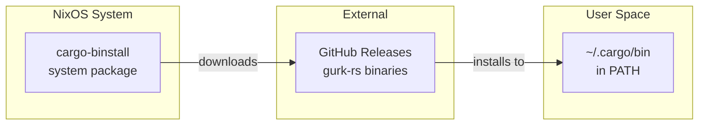
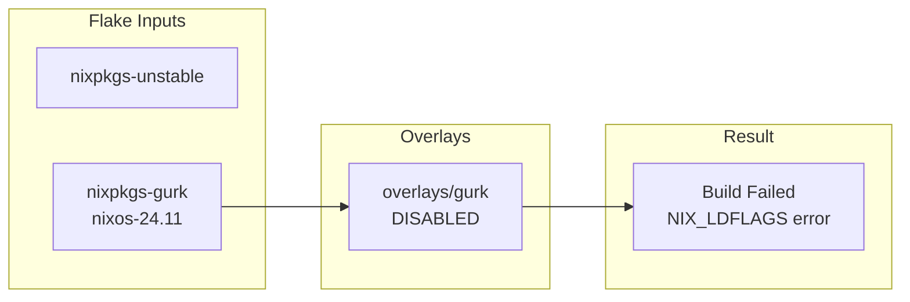

# Install gurk-rs via cargo-binstall - Design Document

## Overview

This design addresses the gurk-rs installation by using cargo-binstall to download pre-built binaries from GitHub releases, bypassing the broken nixpkgs package.

## Architecture

### Final Implementation Flow



### Failed Approach (Documented for Reference)



## Components and Implementation

### 1. System Package Addition (Working)

**File**: `systems/x86_64-linux/Emberroot/default.nix`

```nix
environment.systemPackages = with pkgs; [
  # ... other packages ...
  cargo-binstall # Install pre-built Rust binaries from GitHub
];
```

**Design Decisions**:
- cargo-binstall is a stable nixpkgs package
- Enables installing any Rust binary with GitHub releases
- Reusable for future Rust tools beyond gurk-rs

### 2. PATH Configuration (Working)

**File**: `home/sinh/Emberroot.nix`

```nix
home.sessionPath = [
  "$HOME/.cargo/bin"
];
```

**Design Decisions**:
- Uses home-manager's `sessionPath` for clean PATH management
- Automatically available in all shells after login
- Standard cargo binary location

### 3. NixOS Module (Created but Disabled)

**File**: `modules/nixos/gurk/default.nix`

```nix
{
  config,
  lib,
  pkgs,
  ...
}:
with lib;
let
  cfg = config.modules.gurk;
in
{
  options.modules.gurk = {
    enable = mkEnableOption "gurk-rs - Signal Messenger client for terminal";
  };

  config = mkIf cfg.enable {
    environment.systemPackages = [ pkgs.gurk-rs ];
  };
}
```

**Status**: Disabled (`modules.gurk.enable = false`) - kept for when nixpkgs is fixed

### 4. Overlay (Created but Ineffective)

**File**: `overlays/gurk/default.nix`

```nix
# Overlay to pin gurk-rs to stable nixpkgs due to NIX_LDFLAGS build error in unstable
{ inputs, ... }:
_final: prev:
let
  pkgs-gurk = import inputs.nixpkgs-gurk {
    inherit (prev.stdenv.hostPlatform) system;
    config.allowUnfree = true;
  };
in
{
  inherit (pkgs-gurk) gurk-rs;
}
```

**Status**: Created but build still fails - the issue exists in both unstable and stable nixpkgs

## Usage

### Installing gurk-rs

After system rebuild:
```bash
cargo binstall gurk-rs
```

### Running gurk

After installation and new shell session:
```bash
gurk
```

## Testing Strategy

### Verification Steps
1. Run `sudo sys rebuild` - system builds successfully
2. Run `cargo binstall gurk-rs` - binary downloads and installs
3. Start new shell or re-login
4. Run `gurk` - verify binary works

### Rollback Plan
1. Remove gurk-rs: `rm ~/.cargo/bin/gurk`
2. Optionally remove cargo-binstall from system packages

## Future Considerations

### When nixpkgs is Fixed
1. Enable `modules.gurk.enable = true` in Emberroot system config
2. Remove gurk-rs from cargo: `rm ~/.cargo/bin/gurk`
3. Optionally remove:
   - `nixpkgs-gurk` input from `flake.nix`
   - `overlays/gurk/default.nix`
   - `modules/nixos/gurk/default.nix`

### Monitoring
- Watch [nixpkgs gurk-rs](https://github.com/NixOS/nixpkgs/tree/master/pkgs/applications/networking/instant-messengers/gurk-rs) for fixes
- The infrastructure is ready to switch back when upstream is fixed

---

**Requirements Traceability**: This design addresses all requirements from requirements.md

**Review Status**: Approved

**Last Updated**: 2026-01-08
